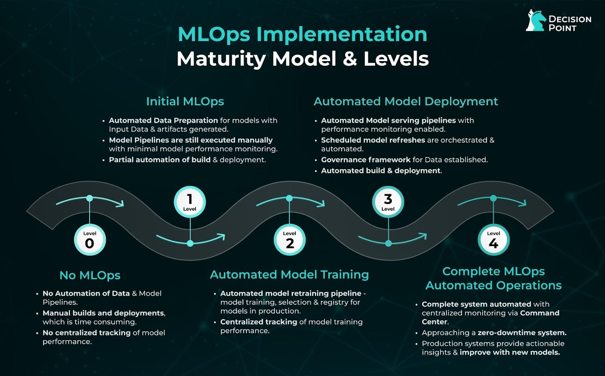

<p align="center">
  
</p>

# 🚀 MLOps Zoomcamp – Week 1: Introduction

**Instructor:** Alexey Grigorev

---

## 📌 1.1 Introduction

**MLOps** (Machine Learning Operations) is a set of best practices for putting Machine Learning models into production. This course tackles tools and techniques to make ML projects production-ready.

📦 **Example use case**: Predicting the duration of a taxi ride.

A basic ML project includes 3 main steps:
- **Design**: Do we really need ML for this problem, or is there a simpler approach?
- **Train**: Build and evaluate a model to achieve our goal.
- **Operate**: Apply the model to new data and ensure it keeps performing well over time.

🖥️ The trained model is often deployed as a **web service (API)**. Once deployed, it must be **monitored** to detect performance degradation due to data drift or other changes.


## 🛠️ 1.2 Environment Preparation

### 🖥️ 1.2.1 GitHub Codespaces

To set up the development environment:

1. Login to GitHub.
2. Create a new **public** repository (with a README).
3. Navigate to `Code` → `Codespaces` → create codespace on `main`.

🎯 **Advantages**: Codespaces come with Python, Docker, Docker Compose, and Node.js pre-installed.

👨‍💻 However, browser environments are limited. To work efficiently:
- Open **Visual Studio Code Desktop** with the Codespaces extension.
- Install **Anaconda**:

```sh
# Download Anaconda
wget https://repo.anaconda.com/archive/Anaconda3-2022.05-Linux-x86_64.sh

# Install Anaconda
bash Anaconda3-2022.05-Linux-x86_64.sh
```

After installation, run:

```sh
# Check Python version
python -V

# Launch Jupyter
jupyter
```

💡 Check the PORTS section in VSCode to visualize local and remote port mapping.


### ☁️ 1.2.2 VM in AWS or Locally with Linux

Another option is to use a Linux VM locally:

✅ Step 1: Install Anaconda
```sh
wget https://repo.anaconda.com/archive/Anaconda3-2022.05-Linux-x86_64.sh
bash Anaconda3-2022.05-Linux-x86_64.sh
```

✅ Step 2: Update packages
```sh
sudo apt update
```

✅ Step 3: Install Docker and Docker Compose
🧱 Official Docker guide
```sh
sudo apt-get update
sudo apt-get install ca-certificates curl
sudo install -m 0755 -d /etc/apt/keyrings
sudo curl -fsSL https://download.docker.com/linux/ubuntu/gpg -o /etc/apt/keyrings/docker.asc
sudo chmod a+r /etc/apt/keyrings/docker.asc

echo \
  "deb [arch=$(dpkg --print-architecture) signed-by=/etc/apt/keyrings/docker.asc] https://download.docker.com/linux/ubuntu \
  $(. /etc/os-release && echo "$VERSION_CODENAME") stable" | \
  sudo tee /etc/apt/sources.list.d/docker.list > /dev/null

sudo apt-get update
sudo apt-get install docker-ce docker-ce-cli containerd.io docker-buildx-plugin docker-compose-plugin
```

🔓 Run Docker without sudo:
```sh
sudo groupadd docker
sudo usermod -aG docker $USER
```

✅ Step 4: Test Docker installation
```sh
docker run hello-world
```

⚠️ If you get a permission denied error with Docker:
```sh
sudo dockerd
```
🔑 If you encounter an error with SSH private key permissions:
```sh
chmod 400 name-of-your-private-key-file.pem
```

### 🧰 1.2.3 Using Installers (Simpler Option)

Install tools using official web installers:
	•	Anaconda
	•	Docker Desktop

Then, create and activate a conda environment:
```sh
conda create -n mlops-zoomcamp python=3.9.7
conda activate mlops-zoomcamp
```

Install common packages:
```sh
conda install numpy pandas scikit-learn seaborn jupyter
```

## 📉 1.3 Training a Ride Duration Prediction Model

**Note**: The NYC taxi data is now in parquet format, not CSV. You can download it using the command:
```sh
# For January
curl -O https://d37ci6vzurychx.cloudfront.net/trip-data/green_tripdata_2021-01.parquet
# For February
curl -O "https://d37ci6vzurychx.cloudfront.net/trip-data/green_tripdata_2021-02.parquet"
```
📦 Install `pyarrow` or `fastparquet` if needed:
```sh
pip install pyarrow
```
The advantage of parquet files is that they are smaller in size.

We trained our model using a [jupyter notebook](notebooks/duration-prediction.ipynb).


## 🧭 1.4 Course Overview

Jupyter notebooks are great for experiments, but can become messy.

Tips:
	•	Use Markdown to track metrics and parameters.
	•	Consider logging experiments using an experiment tracker like MLflow.
	•	Save models to a model registry to keep versions and metadata organized.

⚙️ Use ML pipelines to structure your workflow:
	1.	Load & prepare data
	2.	Vectorize the data
	3.	Train the model

🎯 Pipelines can be parametrized in function of the data and the model we want to train. They output models ready to be deployed as a service.

🛠️ Once deployed, monitor performance. If it drops, retrain the model with new data and redeploy.

📌 Best practice: automate as much as possible.


## 1.5 MLOps maturity model



### 🔢 Maturity Levels:

| Level | Description                                                             |
|-------|-------------------------------------------------------------------------|
| **0** | ❌ No automation. Experiments in Jupyter, no reproducibility.            |
| **1** | ⚙️ DevOps practices applied, but no ML-specific tooling.                 |
| **2** | 🧪 Automated training, experiment tracking, model registry.              |
| **3** | 🚀 Automated deployment, API access, A/B testing, monitoring.            |
| **4** | 🤖 Fully automated ML system – training, deployment, monitoring.         |

📘 Source: [Microsoft MLOps Documentation](https://docs.microsoft.com/en-us/azure/architecture/example-scenario/mlops/mlops-maturity-model) 

For more details:
- Level 0: No ML Ops automation at all.    
Here we use jupyter notebooks for machine learning without proper pipelining, experiment tracking or metadata. When data scientists work alone, this usually happens. It's okay for some experimentations (POC LEVEL) but to pass this stage, we need more automation.

- Level 1: DevOps, No MLOps.     
There is some level of automation. Releases are automated and models can be deployed in the same way as web services in usual software engineering. There is unit test, integration test, CI/CD, operation metrics but systems are not specific to Machine leraning at all. It is not easy to reproduce models. Here we are leaving the POC level for going to production.

- Level 2: Automated Training.
There is ML training pipeline, experiment tracking and model registry (knowing which model is in production or not). The deployment is relatively simple, not necessarily automated - low friction deployment. We should considere it when we have 2 or 3+ cases or models.

- Level 3: Automated Deployment.
After the model is trained, how to easily deploy it? We often have an ML platform (to deploy models). The user can then make API calls to access the model. We can run A/B tests from ML platforms to test different versions of models and decide which is better. Models are often monitored as part of the deployment.

- Level 4: Full MLOps Automated Operations.
Models are automatically trained, retrained, deployed and monitored in one place.

**NB:** 🧠 “Don’t aim to automate everything at once. Start small, iterate, and grow with purpose!”


## 📝 1.6 Homework
Homework for this module is available [here.](notebooks/homework_01.ipynb).

---
