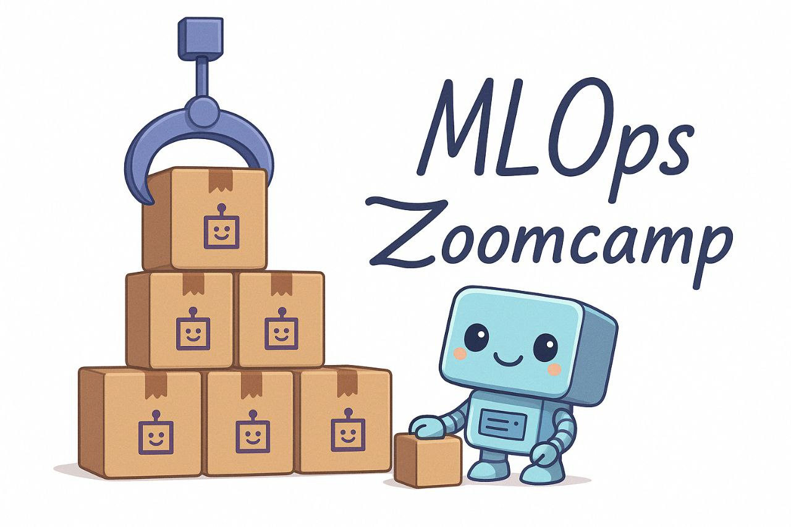

# 🚀 MLOps Zoomcamp – Week 3: Orchestration & ML Pipelines

**Instructor:** Alexey Grigorev

---

## 📌 3.1 Introduction to ML Pipelines 
A **training pipeline** is a sequence of steps executed in order to train a machine learning model, aiming for reproducibility, parameterization, and easy reruns. Pipelines improve upon raw Jupyter notebooks by making workflows maintainable, reliable, and easier to re-execute compared to messy, long notebooks that are difficult to understand or rerun. **Workflow orchestration** is a broader term from data engineering describing how steps are scheduled and organized. ML learning pipelines are a specific application (or workflows) focused on producing ML models.

A Machine Learning Pipeline is nothing more than a sequence of steps needed to produce an ML model:  
  1. **Data ingestion:** Downloading or acquiring data from sources, sometimes called ingestion in data engineering.  
  2. **Data transformation:** Processing data, such as converting columns to datetime, computing new features like duration, filtering outliers, and aggregation.  
  3. **Feature engineering and data preparation:** Creating feature matrices (X) and target arrays (Y) for model input. Note that feature engineering may occur between transformation and preparation.  
  4. **Hyperparameter tuning:** Searching for the best model parameters, using libraries like Hyperopt, to optimize model performance.  
  5. **Model training:** Using the best parameters to train the final model.  
  6. **Model registration:** Saving the trained model to a model registry for deployment or further use.

Converting a notebook into a Python script with well-structured functions for each step improves maintainability and modularity, allowing unit tests and easier updates. Such a script can be executed sequentially, making it a simple but effective pipeline implementation. However using scripts for running pipelines ahs some challenges:
- Running scripts manually or via cron jobs on local machines is impractical for collaboration, scheduling, and scalability.  
- Challenges include coordinating multiple jobs, centralized management, ensuring the latest code version runs, and scaling beyond a single computer.  
- Handling failures (e.g., temporary network issues during data download) requires retry mechanisms, which complicate code and reduce reliability.

Fortunately, **Workflow Orchestration Tools** are very useful: 
- They centralize code management on servers, enable team collaboration, support scheduling, and scale resources as needed.  
- They provide monitoring, alerting, and notifications to manage pipeline health and failures effectively.  
- With **dependency management**, they ensure steps run in the correct order and subsequent steps wait for prior steps to complete successfully.

### Examples of Workflow Orchestration Tools  
| Tool          | Description                                       | Focus Area                      |
|---------------|---------------------------------------------------|--------------------------------|
| Airflow       | Most popular, general-purpose, complex to use     | Data engineering & ML           |
| Prefect       | General-purpose workflow orchestration            | Data engineering & ML           |
| Mage          | General-purpose workflow orchestration            | Data engineering & ML           |
| Luigi         | General-purpose workflow orchestration            | Data engineering & ML           |
| Kubeflow Pipelines | ML-specific pipeline orchestration           | Machine learning                |
| MLflow Pipelines   | ML-specific pipeline orchestration           | Machine learning                |

General-purpose tools work well for diverse tasks including ML and data engineering, offering flexibility but sometimes complexity. ML-specific tools focus on machine learning pipelines, often less flexible but more specialized for model training workflows.

> **💡 PS:** Moving from notebooks to structured pipelines and using orchestration tools is essential for scalable, maintainable, and reliable machine learning workflows in production environments.  
                    


## 🛠️ 3.2 Turning the Notebook into a Python Script
Let's run an instance of **MLflow**:
```sh
mlflow server \
    --backend-store-uri sqlite:///mlflow.db
```
We can then open our [notebook](./notebooks/course/duration-prediction.ipynb) to do some experiments with `MLFlow`. To convert our notebook to a python script, we use the command:
```sh
jupyter nbconvert --to=script duration-prediction.ipynb
```
We will update that [script](./notebooks/course/duration-prediction.py).
The code is refactored into functions for modularity:
  - `read_data` constructs URLs dynamically based on year and month parameters.
  - `create_X` handles feature matrix creation, with logic to fit or reuse a dictionary vectorizer.
  - `train_model` encapsulates the model training process, accepting parameters including the dictionary vectorizer to maintain consistency between training and validation data transformations.
  - A `run` or `main` function is created to orchestrate reading data, feature engineering, model training, and evaluation, supporting flexible execution with different parameters  .

## Parameterization and Testing
Hard-coded year and month parameters are replaced with command-line arguments using `argparse`, allowing users to specify these values dynamically when running the script. The script is tested with specific year and month inputs to verify functionality and debug minor issues like variable names:
```sh
python duration-prediction.py --year=2021 --month=1
```


The current pipeline lacks automatic retry and failure handling; these are identified as future improvements best handled by integrating a **workflow orchestration tool** to manage retries and error handling robustly. The foundation is now ready for orchestration tools to be applied, but even without orchestration, the pipeline can be executed manually to produce models consistently.


> **💡 Key Insight:** Converting a notebook into a script with modular functions and parameterization is a crucial step toward reliable, repeatable ML pipelines and prepares the codebase for integration with orchestration tools for automation and robustness.
    


## 📉 3.3 Using an Orchestrator
### 🖥️ 3.3.1 
### 🧰 3.3.2
### ☁️ 3.3.3
### 🧭 3.3.4
### 3.3.5
### 3.3.6


## 📝 3.4 Homework
Homework for this module is available [here.](notebooks/homework/homework_02.ipynb).

---