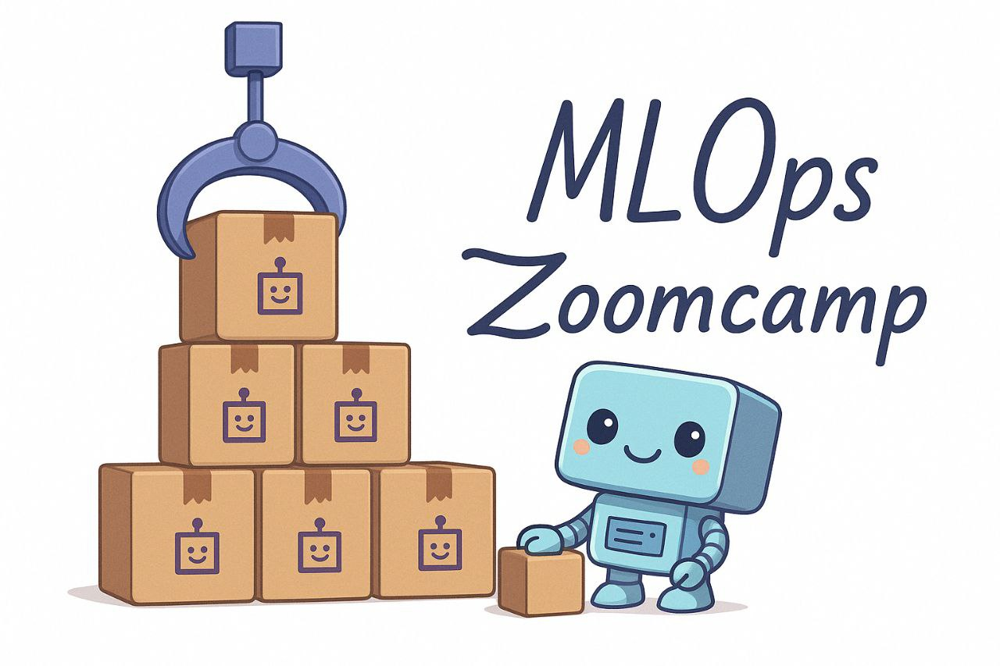
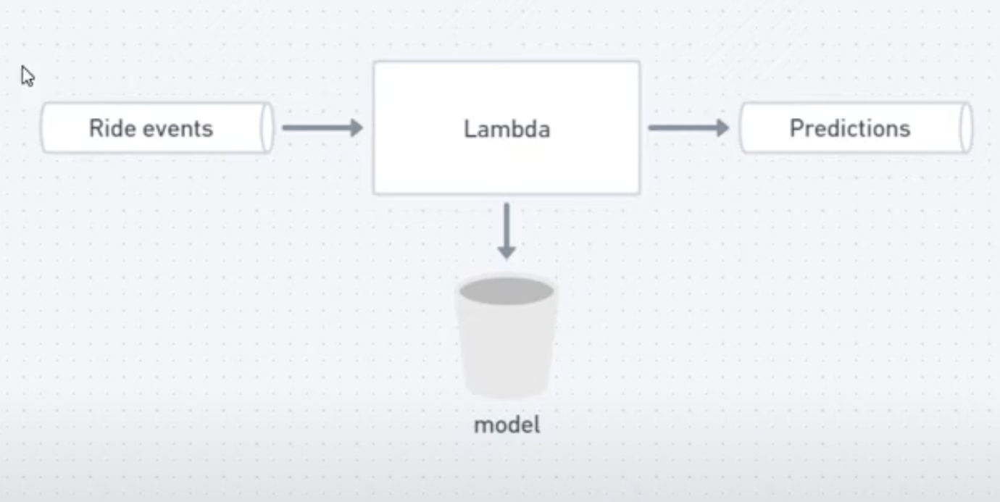
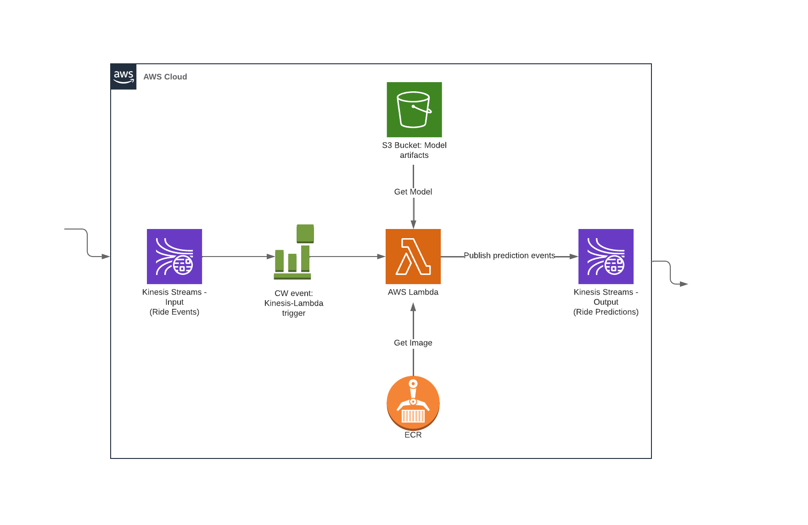

# 🚀 MLOps Zoomcamp – Module 6: Best Practices
**Instructors:** Alexey Grigorev

---
# Plan
- [x] Testing the code: unit tests with pytest
- [x] Integration tests with docker-compose
- [x] Testing cloud services with LocalStack
- [x] Code quality: linting and formatting
- [x] Git pre-commit hooks
- [x] Makefiles and make
- [ ] Staging and production environments
- [ ] Infrastructure as Code
- [ ] CI/CD and GitHub Actions
---

# Part A
## 📌 6.1 Testing Python code with pytest
This module covers best practices for testing Python code, using an example from [Module 4](../04_deployment/) involving a streaming architecture with Lambda and Kinesis. 

This architecture included an events stream, a Lambda function processing events and getting a model from S3 or locally, and a predictions stream for output. Here we want to add **unit tests** and **integration tests** to the Lambda function code to improve its engineering quality.    

#### Setting up the Testing Environment
For that we will:
- Set our `pipenv` environment using [Pipfile](./notebooks/course/streaming/Pipfile): `pipenv install --python=3.9`.
> Note that for deleting the Pipenv environment, you should first delete the environment: `pipenv --rm` and then remove Pipfile files: `rm Pipfile*`.
- Create a `tests` folder to store test files: `mkdir tests`.
- Add a `__init__.py` file in the `tests` folder to let **python** know that it is a **Python package** and a [test file](./tests/model_test.py) for testing.
- Install the **pytest** library as a development dependency using `pipenv`: `pipenv install --dev pytest`. Note we only need that library for performing tests during the development. We do not need it for production.
> To check `pytest` version, you can run the command: `pipenv run pytest --version`.
- Configure Visual Studio Code to discover and run tests:
    - Check the Python extension and install it on SSH or restart if needed.
    - Use the shortcut `Command + Shift + P` and select the **correct Python interpreter** (the virtual environment): it is tagged with **Pipenv** and its path can be checked using the command `pipenv --venv`.
    - We can now configure Python tests using the tab on the left. Note that we will have to select the Python test framework `pytest` and specify the [tests](./notebooks/course/streaming/tests/) directory. 
    - A basic test like `assert 1 == 1` can be used to confirm pytest setup is working.         

#### Refactoring Code for Testability
Initially, attempting to import the original [`lambda_function.py`](../../../../04_deployment/notebooks/course/4.4_streaming/lambda_function.py) directly for testing fails because global variables (like the model loading logic) are executed upon import. In fact, the logic that requires external resources (like S3) is at the top level, making simple unit testing difficult. Hence the need to perform some refactoring. We will simplfy the original [lambda function](./lambda_function.py) so that it imports the [model from another script](./model.py). This way, we will define a model class for that script and will be able to perform [unit tests](./tests/model_test.py) for the methods of that model. This refactoring allows unit tests to import the `model.py` file without triggering the problematic global logic. Note that to handle external dependencies (put predictions into a Kinesis stream), we will create a **callback mechanism**. With the code refactory completed, Pytest works well. There are green checks to confirm that in the testing panel.

> Tests can also be run through the command line interface: `pipenv run pytest tests`.

We can now update our [Dockerfile](./Dockerfile) and build the model image:

```bash
docker build -t stream-model-duration:v2 .
```
then run it:
```bash
docker run -it --rm \
    -p 8080:8080 \
    -e PREDICTIONS_STREAM_NAME="ride_predictions" \
    -e MODEL_RUN_ID="1ca05c6d23f44066a4a4dcdbe1639de4" \
    -e TEST_RUN="True" \
    -e AWS_DEFAULT_REGION="us-east-1" \
    -e AWS_ACCESS_KEY_ID="${AWS_ACCESS_KEY_ID}" \
    -e AWS_SECRET_ACCESS_KEY="${AWS_SECRET_ACCESS_KEY}" \
    stream-model-duration:v2
```
> Note that we need to pass credentials using the command line interface, before running the image:
```sh
AWS_ACCESS_KEY_ID="ID_123"
AWS_SECRET_ACCESS_KEY="Key_123"
```
To test our docker image, we can run a [test script](./notebooks/course/streaming/test_docker.py): `python test_docker.py`.

#### Unit Tests vs. Integration Tests
- **Unit tests** focus on testing small, isolated pieces of code (functions, methods). They are independent and fast.   
- **Integration tests** verify that different parts of the system work together correctly, potentially involving external services.    

| Test Type          | Scope                               | Dependencies               | Speed | Purpose                                   |
| :----------------- | :---------------------------------- | :------------------------- | :---- | :---------------------------------------- |
| **Unit Tests**     | Individual functions/methods        | Mocked/Isolated            | Fast  | Verify correctness of small code units    |
| **Integration Tests**| Multiple components working together | Real or simulated external | Slower| Verify system parts integrate correctly |


## 🛠️ 6.2 Integration tests with docker-compose
Previously, we refactored the Lambda function code to delegate core logic to a `model.py` file, making it easier to test individual components. We then implemented unit tests to cover specific functions within the `model.py` file, but their scope was limited to individual functions and did not verify the entire system's functionality or its ability to handle requests and responses. For testing the entire system, we initially run a docker image and a [testing script](./notebooks/course/streaming/test_docker.py). We will convert this script into a [**proper integration test**](./notebooks/course/streaming/integration-test/test_docker.py) by adding `assert` statements to compare actual and expected responses. To compare complex dictionary responses and identify specific differences, we will install the `deepdiff` library:
```sh
pipenv install deepdiff
```
It can even be configured with a `significant_digits` tolerance for float comparisons.  

#### Managing Test Dependencies
Integration tests should ideally limit external dependencies to ensure reliability and offline execution. For this reason and also to avoid using S3 buckets, we earlier decided earlier to copy the [MLFlow artifact fodler](./notebooks/course/streaming/mlflow-models/) to the docker image instead of connecting to an s3 bucket. To facilitate local model loading in Docker, one can decide to download the model files from S3 to a local `model` folder within the `integration_test` directory:
```sh
aws s3 cp --recursive MODEL_REMOTE_LOCATION model
```
with `MODEL_REMOTE_LOCATION=s3://{model_bucket}/{experiment_id}/{run_id}/artifacts/model` the remote address of the model.
Once done, we can **mount** this local `model` folder into the Docker container using the `-v` flag (`-v ./model:/app/model`), and setting the `MODEL_LOCATION` environment variable to the container's path (`/app/model`).

From the [integration test folder](./notebooks/course/streaming/integration-test/), we can build the model image:

```bash
docker build -t stream-model-duration:v2 ..
```
and then run it :
```bash
docker run -it --rm \
    -p 8080:8080 \
    -e PREDICTIONS_STREAM_NAME="ride_predictions" \
    -e MODEL_RUN_ID="1ca05c6d23f44066a4a4dcdbe1639de4" \
    -e MODEL_LOCATION="/app/model" \
    -e TEST_RUN="True" \
    -e AWS_DEFAULT_REGION="us-east-1" \
    -e AWS_ACCESS_KEY_ID="${AWS_ACCESS_KEY_ID}" \
    -e AWS_SECRET_ACCESS_KEY="${AWS_SECRET_ACCESS_KEY}" \
    -v $(pwd)/model:/app/model \
    stream-model-duration:v2
```
> Note that we need to pass credentials using the command line interface as done [previously](#-61-testing-python-code-with-pytest).

Finally, we can test the image:
```sh
pipenv run python test_docker.py
```

> The **Kinesis callback** functionality can be tested by setting the `test_run` flag is to `False` and running the commamd:
```sh
pipenv run python test_kinesis.py
```


#### Automating Integration Tests with Docker Compose
The entire testing workflow, including building the Docker image, running the service, executing tests, and stopping the service, can be automated using a [shell script](./notebooks/course/streaming/integration-test/run.sh). The script ensures it always runs from its own directory using a specific bash command. Docker image tags are dynamically generated using the current date and time to ensure uniqueness. **Docker Compose**  is used to manage the service's configuration, including image name, exposed ports, environment variables (e.g., `MODEL_LOCATION`), and volume mounts for the local model folder.    

> For the automation to work, we neeed to update the credentials in the [docke-compose configuration file](./notebooks/course/streaming/integration-test/docker-compose.yaml) and also to make the script executable:
```sh
chmod +x run.sh
```
and run it:
```sh
bash run.sh
```

#### Handling Script Exit Codes for CI/CD
For Continuous Integration/Continuous Deployment (CI/CD) systems, a script's exit code determines job success (0) or failure (non-zero). Using `set -e` in a bash script forces it to exit immediately upon the first non-zero command, but this can prevent cleanup actions like `docker-compose down`. A more robust approach is to manually capture the test's exit code into a variable and then conditionally print Docker Compose logs and exit with the captured code after ensuring `docker-compose down` is executed. This ensures that if tests fail, the CI/CD job will be marked as failed, and relevant container logs will be available for debugging.   


## 📉 6.3 

## 🖥️ 6.4 

## 🧰 6.5 

## 🧭 6.6 

## 📝 6.7 Homework
Homework for this module is available [here.](notebooks/homework/homework_06.ipynb).

---   

# Part B

### Infrastructure-as-Code
with Terraform 



#### Summary
* Setting up a stream-based pipeline infrastructure in AWS, using Terraform
* Project infrastructure modules (AWS): Kinesis Streams (Producer & Consumer), Lambda (Serving API), S3 Bucket (Model artifacts), ECR (Image Registry)

Further info here:
* [Concepts of IaC and Terraform](docs.md#concepts-of-iac-and-terraform)
* [Setup and Execution](https://github.com/DataTalksClub/mlops-zoomcamp/tree/main/06-best-practices/code#iac)

#### 6B.1: Terraform - Introduction

https://www.youtube.com/watch?v=zRcLgT7Qnio&list=PL3MmuxUbc_hIUISrluw_A7wDSmfOhErJK&index=48

* Introduction
* Setup & Pre-Reqs
* Concepts of Terraform and IaC (reference material from previous courses)

#### 6B.2: Terraform - Modules and Outputs variables

https://www.youtube.com/watch?v=-6scXrFcPNk&list=PL3MmuxUbc_hIUISrluw_A7wDSmfOhErJK&index=49

* What are they?
* Creating a Kinesis module

#### 6B.3: Build an e2e workflow for Ride Predictions

https://www.youtube.com/watch?v=JVydd1K6R7M&list=PL3MmuxUbc_hIUISrluw_A7wDSmfOhErJK&index=50

* TF resources for ECR, Lambda, S3

#### 6B.4: Test the pipeline e2e

https://www.youtube.com/watch?v=YWao0rnqVoI&list=PL3MmuxUbc_hIUISrluw_A7wDSmfOhErJK&index=51

* Demo: apply TF to our use-case, manually deploy data dependencies & test
* Recap: IaC, Terraform, next steps

Additional material on understanding Terraform concepts here: [Reference Material](docs.md#concepts-of-iac-and-terraform)

<br>

### CI/CD
with GitHub Actions


#### Summary

* Automate a complete CI/CD pipeline using GitHub Actions to automatically trigger jobs 
to build, test, and deploy our service to Lambda for every new commit/code change to our repository.
* The goal of our CI/CD pipeline is to execute tests, build and push container image to a registry,
and update our lambda service for every commit to the GitHub repository.

Further info here: [Concepts of CI/CD and GitHub Actions](docs.md#concepts-of-ci-cd-and-github-actions)


#### 6B.5: CI/CD - Introduction

https://www.youtube.com/watch?v=OMwwZ0Z_cdk&list=PL3MmuxUbc_hIUISrluw_A7wDSmfOhErJK&index=52

* Architecture (Ride Predictions)
* What are GitHub Workflows?

#### 6B.6: Continuous Integration

https://www.youtube.com/watch?v=xkTWF9c33mU&list=PL3MmuxUbc_hIUISrluw_A7wDSmfOhErJK&index=53

* `ci-tests.yml`
    * Automate sections from tests: Env setup, Unit test, Integration test, Terraform plan
    * Create a CI workflow to trigger on `pull-request` to `develop` branch
    * Execute demo

#### 6B.7: Continuous Delivery

https://www.youtube.com/watch?v=jCNxqXCKh2s&list=PL3MmuxUbc_hIUISrluw_A7wDSmfOhErJK&index=54

* `cd-deploy.yml`
    * Automate sections from tests: Terraform plan, Terraform apply, Docker build & ECR push, Update Lambda config
    * Create a CD workflow to trigger on `push` to `develop` branch
    * Execute demo

#### Alternative CICD Solutions

* Using args and env variables in docker image, and leveraging makefile commands in cicd
    * Check the repo [README](https://github.com/Nakulbajaj101/mlops-zoomcamp/blob/main/06-best-practices/code-practice/README.md)
    * Using the args [Dockerfile](https://github.com/Nakulbajaj101/mlops-zoomcamp/blob/main/06-best-practices/code-practice/Dockerfile)
    * Using build args [ECR terraform](https://github.com/Nakulbajaj101/mlops-zoomcamp/blob/main/06-best-practices/code-practice/deploy/modules/ecr/main.tf)
    * Updating lambda env variables [Post deploy](https://github.com/Nakulbajaj101/mlops-zoomcamp/blob/main/06-best-practices/code-practice/deploy/run_apply_local.sh)
    * Making use of make file commands in CICD [CICD](https://github.com/Nakulbajaj101/mlops-zoomcamp/tree/main/.github/workflows)
